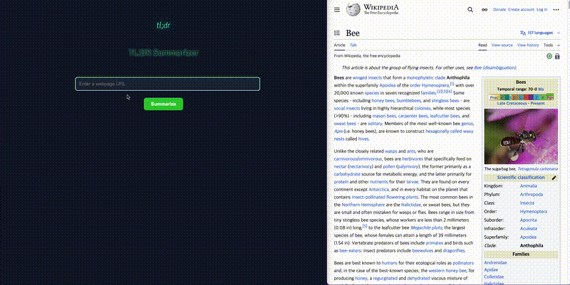

# My Project

TL;DR Summarizer
📌 Overview

TL;DR Summarizer is a full-stack web application that scrapes web pages and generates concise summaries in under 300 characters using Puppeteer and OpenAI’s API.
The goal is to help users quickly understand lengthy articles without reading them in full.

🎯 Purpose

Reduce information overload by compressing long-form content into bite-sized summaries.

Provide a lightweight and intuitive tool for students, professionals, and researchers.

Explore real-world integration of web scraping + LLM summarization in a production-ready app.

⚙️ Tech Stack

Frontend (Client)

React + TypeScript (Vite)

Custom CSS styling (with modal, animations, and input effects)

Backend (Server)

Node.js + Express

Puppeteer (web scraping)

OpenAI API (text summarization)

dotenv (environment management)

Other Tools

Postman (API testing)

GitHub for version control

🚀 Features

Paste any URL and receive a short AI-generated summary.

Clean, modern UI with animations and modal for result display.

Error handling (invalid URLs, server issues, etc.).

Dark-mode inspired modal design for better readability.

📂 Project Structure
tldr-ai-summarizer/
 ├── client/   # Frontend (React + Vite)
 ├── server/   # Backend (Express + Puppeteer + OpenAI)
 ├── .env      # Environment variables (not pushed to GitHub)
 
🔧 Installation & Run
# Clone repository
git clone https://github.com/starsang45/tldr-ai-summarizer.git
cd tldr-ai-summarizer

# Install dependencies
cd server && npm install
cd ../client && npm install

# Run backend
cd server
npm run dev

# Run frontend (in another terminal)
cd client
npm run dev

